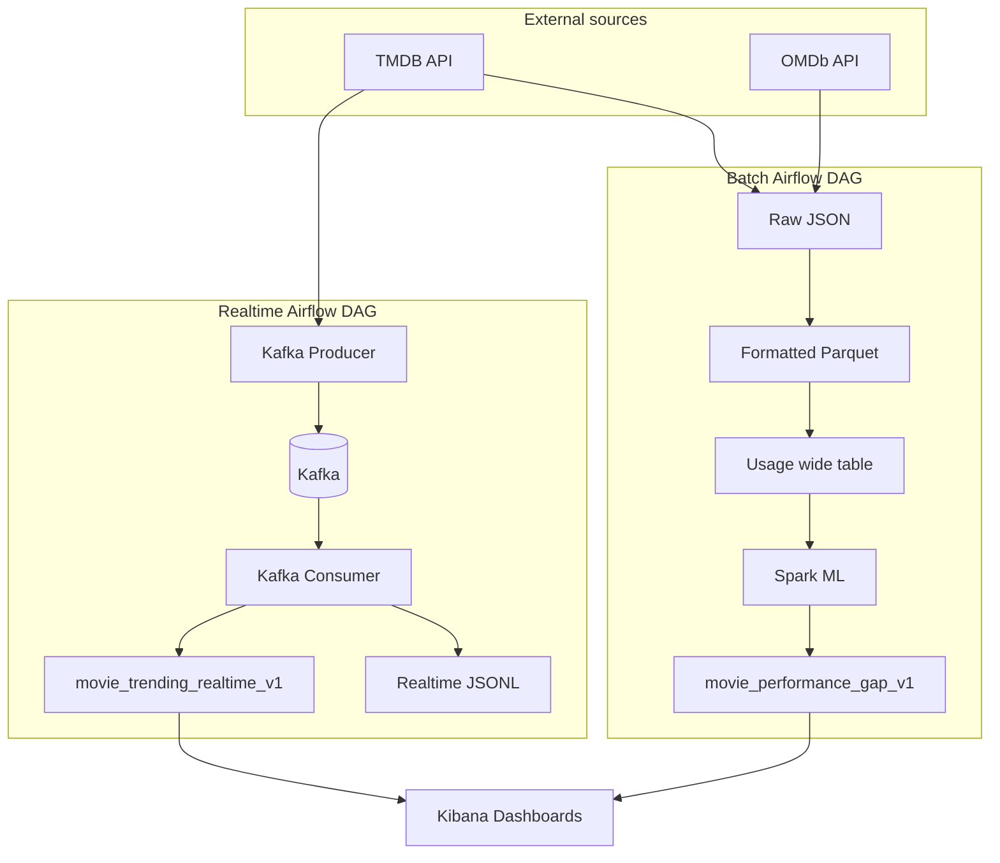

# Movie Ratings vs Box Office Performance: End-to-End Big Data

> This post documents a course/personal big data project built around one question: **Do highly rated movies always perform well at the box office?**  
> The pipeline ingests TMDB and OMDb into a local data lake, cleans and joins data with Spark, predicts revenue and labels commercial performance with Spark ML, and exposes batch analytics plus realtime Trending monitoring in Elasticsearch and Kibana.

---

## 1. What question does this project answer?

Audiences often assume “high score = strong box office,” but reality includes several patterns:

- **Hidden gem**: strong reviews, modest revenue  
- **Blockbuster paradox**: high revenue, average ratings  
- **Over / under expectation**: actual revenue clearly above or below what the model expects  

This is not only descriptive statistics. The project implements a reproducible pipeline that:

1. Pulls movie metadata, budget, revenue, popularity, posters, and trailers from **TMDB**  
2. Pulls IMDb, Rotten Tomatoes, Metacritic, and supplemental box office from **OMDb**  
3. Cleans, joins, and derives business metrics with **Spark**  
4. Uses **Spark ML (Random Forest)** to predict expected revenue for **active** releases and assign commercial labels  
5. Delivers interactive analysis in **Elasticsearch + Kibana**, and tracks TMDB daily **Trending** changes through **Kafka**  

---

## 2. Architecture overview



### Tech stack

| Layer | Technology |
|-------|------------|
| Orchestration | Apache Airflow (CeleryExecutor) |
| Ingestion | Python + REST APIs |
| Processing | Apache Spark (`local[*]`) |
| Machine learning | Spark ML (`RandomForestRegressor`) |
| Messaging | Apache Kafka |
| Search & analytics | Elasticsearch 8.x + Kibana 8.x |
| Runtime | Docker Compose |

> **Note:** The current version uses a **local filesystem** data lake under `data/` (no S3/HDFS). Batch indexing uses **full refresh** (delete index, reload all documents). The realtime index uses **append-only** event writes.

---

## 3. Data sources and join strategy

### 3.1 TMDB (primary)

The batch pipeline seeds movie IDs from the **Popular** list (cap controlled by `MAX_MOVIES_FOR_DETAILS`, default **200**), then calls:

- `GET /movie/popular` (paginated)
- `GET /movie/{id}` (details with `append_to_response=videos`)
- `GET /movie/{id}/external_ids` (IMDb ID)

Key fields include title, release date, genres, runtime, budget, revenue, popularity, votes, production countries, poster path, and YouTube trailer keys.

### 3.2 OMDb (supplement)

The pipeline **does not query by title** (ambiguous matches, language issues). It reads **IMDb IDs** from TMDB `external_ids` and calls `?i={imdb_id}` for:

- IMDb / Rotten Tomatoes / Metacritic ratings  
- North American box office, etc.  

### 3.3 How sources are joined

- **TMDB is the left table**; **left join** OMDb on `imdb_id`  
- Movies without OMDb data are kept; rating fields are simply null  

---

## 4. Data lake layers

Path pattern: `data/{layer}/{group}/{table}/{YYYYMMDD}/`

```text
data/
  raw/                    # Raw API JSON
    tmdb/
      tmdb_popular/
      tmdb_movie_details/
      tmdb_external_ids/
    omdb/
      omdb_movie_details/
  formatted/              # Spark-cleaned Parquet
    tmdb/tmdb_movie_details/
    omdb/omdb_movie_ratings/
  usage/                  # Business wide table (one row per movie)
    ratings_boxoffice_analysis/movie_performance_gap/
  realtime/               # Kafka event JSONL
    movie/tmdb_trending_events/
```

| Layer | Purpose |
|-------|---------|
| **Raw** | Preserve API payloads for replay and debugging |
| **Formatted** | Typed, deduplicated, N/A-normalized tables |
| **Usage** | Feed ML and Elasticsearch directly |
| **Realtime** | Event-level storage, separate from batch usage |

---

## 5. Batch pipeline (8 steps)

Airflow DAG: `movie_batch_pipeline_dag` (scheduled **daily** by default)

```text
Ingest Popular → details + external_ids → OMDb
    → Spark format TMDB / OMDb
    → Spark combine
    → Spark ML
    → Index to Elasticsearch
```

### Steps 1–2: Ingestion

- **TMDB**: Popular list → movie details + external_ids → raw JSON  
- **OMDb**: IMDb IDs from external_ids → per-movie requests → raw JSON  

### Step 3: Formatting (Spark)

- TMDB: build `poster_url` (`https://image.tmdb.org/t/p/w500` + `poster_path`)  
- TMDB: pick an **official YouTube Trailer** from `videos` → `youtube_trailer_url`  
- OMDb: parse rating strings, dates, USD box office, etc.  

### Steps 4–5: Combine and business fields (`combine_ratings_boxoffice`)

#### `rating_consensus_score` (0–100)

Weighted average across platforms; **only available sources count toward the denominator**:

| Source | Weight |
|--------|--------|
| TMDB `vote_average × 10` | 0.35 |
| OMDb IMDb (0–100 scale) | 0.35 |
| Rotten Tomatoes | 0.20 |
| Metacritic | 0.10 |

Formula:

```text
rating_consensus_score = weighted sum of available scores / sum of weights for available sources
```

#### `actual_final_revenue`

**Not weighted**; priority fallback:

```text
if TMDB revenue > 0 → use TMDB revenue
else → use OMDb BoxOffice
```

#### `movie_lifecycle`

- **historical**: released at least 12 months ago  
- **active**: released within 12 months, or missing release date  

This separates films usable for training from films that need prediction.

### Step 6: Spark ML revenue prediction

**Goal:** predict `predicted_final_revenue` for **active** movies and label commercial performance vs expectation.

| Item | Detail |
|------|--------|
| Training set | `historical` with `actual_final_revenue > 0` |
| Scoring set | `active` movies |
| Model | Spark ML `RandomForestRegressor` (e.g. 120 trees) |
| Target | `log1p(actual_final_revenue)`, inverted with `exp` after prediction |
| Features | budget, runtime, year, TMDB rating/votes/popularity, consensus score, platform scores, genre & country (one-hot) |

**Commercial labels** (active only, when `predicted_final_revenue > 0`):

| `performance_category` | Condition |
|------------------------|-----------|
| Commercial Overperformer | `ml_gap_ratio > 20%` |
| Commercial Underperformer | `ml_gap_ratio < -20%` |
| As Expected | between ±20% |

Where:

```text
ml_revenue_gap = actual_final_revenue - predicted_final_revenue
ml_gap_ratio = ml_revenue_gap / predicted_final_revenue
```

> **Note:** `historical` titles are used for training but usually **do not** get prediction or label fields in the final usage table. Dashboard ML KPIs mainly reflect the **active** subset.

Model artifacts: `artifacts/models/{YYYYMMDD}/spark_revenue_model/`.

### Step 7: Write to Elasticsearch

- Index: `movie_performance_gap_v1`  
- Document ID: `document_id` (`tmdb-{tmdb_id}`)  
- Strategy: **delete the index, then bulk-load the full usage partition** (full refresh), so ES matches the current batch snapshot  

---

## 6. Realtime pipeline: TMDB Trending

Airflow DAG: `movie_realtime_pipeline_dag` (about **every minute**)

```text
TMDB trending/movie/day
    → Kafka Producer (diff vs last run)
    → Topic: movie_trending_events
    → Kafka Consumer
    → data/realtime/.../*.jsonl
    → Elasticsearch: movie_trending_realtime_v1
```

### Producer behavior

- Fetch trending list (default max **100**, `REALTIME_TRENDING_LIMIT`)  
- Assign `rank` by list order  
- Compare with `artifacts/realtime/last_trending_state.json`; each snapshot event includes:  
  - `changed_fields`, `has_change`  
  - `*_previous_value`, `*_change_direction` per metric  
- **One `trending_snapshot` per movie per run** (`has_change` may be false when nothing changed)

### Consumer behavior

- Consume Kafka messages  
- Append to the realtime data lake (JSONL)  
- Index into ES by `event_id` (**no index delete**; append-only)

The realtime dashboard shows the **latest Top 100 snapshot** with before/after arrows for rank, popularity, vote_average, and vote_count.

---

## 7. Elasticsearch and Kibana

### 7.1 Batch index `movie_performance_gap_v1`

- **Grain:** one document per movie  
- **Purpose:** KPIs plus drill-down to posters, trailers, predicted revenue, and labels  

Example fields:

| Field | Meaning |
|-------|---------|
| `tmdb_id` / `imdb_id` | IDs and linkage |
| `title` / `release_date` | Basics |
| `movie_lifecycle` | historical / active |
| `rating_consensus_score` | Consensus rating |
| `actual_final_revenue` | Observed revenue |
| `predicted_final_revenue` | Model expectation (active) |
| `ml_gap_ratio` | Actual vs expected (ratio) |
| `performance_category` | Over / Under / As Expected |
| `poster_url` / `youtube_trailer_url` | Visualization links |

### 7.2 Realtime index `movie_trending_realtime_v1`

- **Grain:** one event per movie at a point in time  
- Time field: `event_time_utc`  
- Key fields: `rank`, `popularity`, `vote_average`, `vote_count`, `changed_fields`, `has_change`, etc.  

### 7.3 Dashboards (`kibana/kibana_export.ndjson`)

**Batch dashboard** (`movie_performance_gap_v1`)

- Lens KPIs: last update time, total movies, historical/active counts, ML training count, predicted count, three commercial label counts  
- Vega: **poster table** (clickable trailers), **rating vs revenue scatter** (poster bubbles, active labels colored)

**Realtime dashboard** (`movie_trending_realtime_v1`)

- Vega: **TMDB Top 100** latest snapshot with rank/popularity/rating/vote before-after indicators  

---

## 8. Run locally

### 8.1 Prerequisites

- Docker Desktop  
- TMDB API key and OMDb API key  

### 8.2 Configuration

```bash
cp .env.example .env
# Edit .env and set TMDB_API_KEY and OMDB_API_KEY
```

Optional:

```env
MAX_MOVIES_FOR_DETAILS=200
REALTIME_TRENDING_LIMIT=100
```

### 8.3 Start the stack

```bash
docker compose up -d --build
```

Services include Airflow (8080), Elasticsearch (9200), Kibana (5601), Kafka, Postgres, and Redis.

Default Airflow login: `admin` / `admin`. After first boot, **unpause** the DAGs in the UI.

### 8.4 Trigger pipelines

```bash
# Batch
docker compose exec airflow-webserver airflow dags trigger movie_batch_pipeline_dag

# Realtime (scheduled every minute; can also trigger manually)
docker compose exec airflow-webserver airflow dags trigger movie_realtime_pipeline_dag
```

Or use the Makefile:

```bash
make up
make run-all
make run-realtime
```

### 8.5 Import Kibana saved objects

In Kibana → **Stack Management → Saved Objects**, import:

`kibana/kibana_export.ndjson`

Create the data views, then open both dashboards.

---

## 9. Repository layout (main folders)

```text
bigdata-datalack-movie/
  dags/                 # Airflow DAGs
  src/                  # Ingestion, indexing, config
  spark_jobs/           # Format, combine, ML
  streaming/            # Kafka producer / consumer
  docker/               # Airflow image
  kibana/               # Dashboard export
  data/                 # Local data lake
  artifacts/            # ML models and realtime state
  docs/                 # Documentation (this page)
```

---

## 10. Limitations and future work

1. **Sample size:** Popular list + cap of 200 titles; trainable historical movies with revenue > 0 can be single-digit—model is illustrative.  
2. **Incomplete active revenue:** `actual_final_revenue` for active releases may still be growing; interpret gaps vs predictions carefully.  
3. **No distributed object storage:** S3/MinIO/HDFS not integrated yet.  
4. **Batch ES full refresh:** each run rebuilds the index—fine for demos; production would use incremental upsert by `document_id`.  
5. **Realtime is not sub-second:** refresh is bounded by Airflow’s minute schedule, not push streaming from TMDB.  
6. **No Spark Streaming:** realtime path uses a Python Kafka consumer, not Structured Streaming.  

Possible extensions: broader movie coverage, feature store, model metrics (MAPE/RMSE), multi-source sync (e.g. Airbyte), and publishing dashboards via GitHub Pages.

---

## 11. Summary

This project implements a full path from **multi-source ingestion → layered data lake → Spark join & ML → search & analytics → realtime Trending monitoring**. Main ideas:

- Reliable TMDB/OMDb linkage via **IMDb ID**  
- A single review lens via dynamically weighted **`rating_consensus_score`**  
- **Lifecycle + Random Forest** to compare expected vs actual revenue with interpretable labels  
- **Kibana** for both batch drill-down and live trending movement  

If you are reading this on GitHub Pages, use the repo’s DAGs, Spark jobs, and Kibana export to reproduce the pipeline end to end.

---

## Appendix: batch DAG task order

```text
extract_tmdb_popular
  → extract_tmdb_movie_details
  → extract_tmdb_external_ids
  → extract_omdb_movie_details
  → spark_format_tmdb
  → spark_format_omdb
  → spark_combine_sources
  → spark_train_ml_model
  → index_usage_to_elasticsearch
```

---


